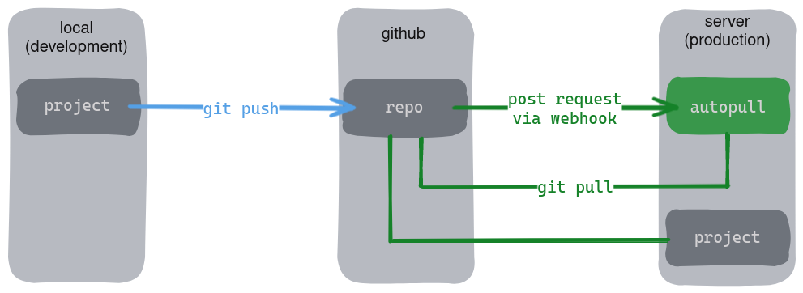

🔄 A real-time Git auto-sync tool.

A simple HTTP server written in Go that monitors pushes to your Git repository in real-time, and pulls them from your Git repository.



## Getting Started
### Prerequisites
- Go >= 1.19
- Git

### Install autopull
You can install it via `go install` command.
```
go install github.com/lareii/autopull@latest
```

You can add the tool to path for quick access. (optional)

### Set Webhook
1. Choose a repository and click on the "Settings" tab at the top of the repository page.

2. Locate the "Webhooks" section in the left-hand sidebar.

3. In the Webhooks section, there is typically a button labeled "Add webhook" or "New webhook". Click on it to start creating a new webhook.

4. In the "Payload URL" field, enter the URL where you want GitHub to send the payload when an event occurs.

5. In the "Content type" field, select `application/json`.

6. Scroll down to the "Secret" section. Generate a secure secret key and enter it in the "Secret" field. This key will be used to secure the communication between GitHub and your server.

7. Select "Just the push event." as the event that should trigger the webhook.

8. After configuring the webhook settings, scroll down and click on the "Add webhook" or "Create webhook" button to save your changes.

9. Once the webhook is added, GitHub will send a test payload to the provided URL. Ensure that your server can receive and process this payload.

10. Back in the Webhooks section, you should see your newly added webhook. Verify that the "Recent Deliveries" section shows a successful delivery status.

### Usage
```
autopull <repo_path> <secret>
```

Example usage:
```
autopull ~/website "mysupersecretoken"
```

🎉 Ta-da! Ready to use. Try to push something.

## Contributing
Contributions are welcome! To contribute, simply fork the repository, make your desired changes, and submit a pull request.

## License
This project is licensed under the MIT License. For more information, see the [LICENSE file](./LICENSE).